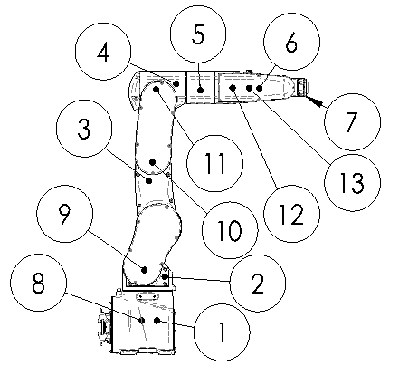

# 3.1. 각 부위 명칭

본체 각부의 명칭을 그림 3.1 및 표 3-1에 표시합니다. 

그림 3.1 본체 각 부위 명칭

 

<table class="tg">
<caption> 표 3-1 본체 각 부위 명칭</caption>  
<thead>
  <tr>
    <th class="tg-bgl2">No.</th>
    <th class="tg-bgl2">각 부 명칭</th>
    <th class="tg-bgl2">No.</th>
    <th class="tg-bav5">각 부 명칭</th>
  </tr>
</thead>
<tbody>
  <tr>
    <td class="tg-baqh">1</td>
    <td class="tg-baqh">베이스 바디(BASE BODY)</td>
    <td class="tg-baqh">8</td>
    <td class="tg-baqh">S축 모터</td>
  </tr>
  <tr>
    <td class="tg-baqh">2</td>
    <td class="tg-baqh">하부 프레임(LOWER FRAME)</td>
    <td class="tg-baqh">9</td>
    <td class="tg-baqh">H축 모터</td>
  </tr>
  <tr>
    <td class="tg-baqh">3</td>
    <td class="tg-baqh">상부 프레임(UPPER FRAME)</td>
    <td class="tg-baqh">10</td>
    <td class="tg-baqh">V축 모터</td>
  </tr>
  <tr>
    <td class="tg-baqh">4</td>
    <td class="tg-baqh">암 프레임(ARM FRAME)</td>
    <td class="tg-baqh">11</td>
    <td class="tg-baqh">R2축 모터</td>
  </tr>
  <tr>
    <td class="tg-baqh">5</td>
    <td class="tg-baqh">암 파이프(ARM PIPE)</td>
    <td class="tg-baqh">12</td>
    <td class="tg-baqh">B축 모터</td>
  </tr>
  <tr>
    <td class="tg-baqh">6</td>
    <td class="tg-baqh">손목부(WRIST BODY)</td>
    <td class="tg-baqh">13</td>
    <td class="tg-baqh">R1축 모터</td>
  </tr>
  <tr>
    <td class="tg-baqh">7</td>
    <td class="tg-baqh">손목부(WRIST HOLDER)</td>
    <td class="tg-baqh"></td>
    <td class="tg-baqh"></td>
  </tr>
</tbody>
</table>
