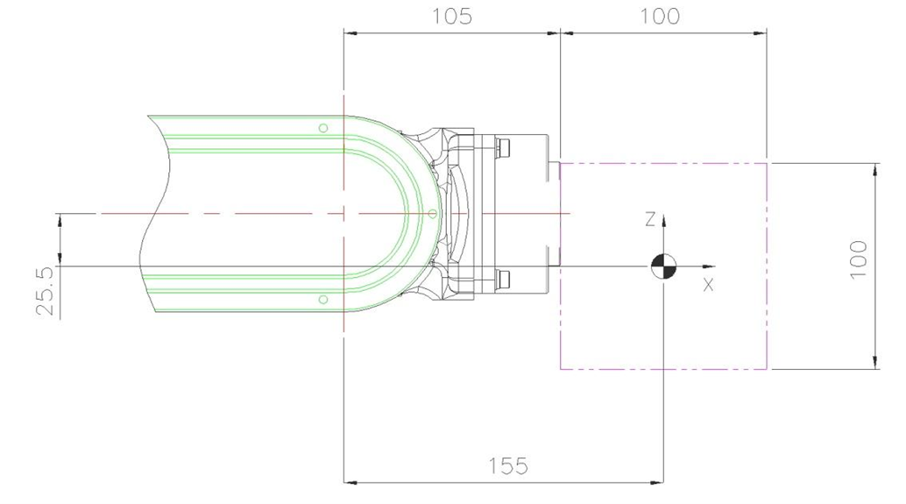
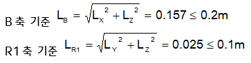
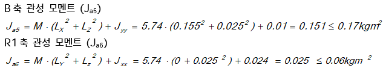

# 3.5.2. 허용 토크, 관성 모멘트 계산 예 (HA006B Case)

[그림 3.7, 3.8]은취부되는 부하가 질점에 있다고 생각되는 경우에 그 질점이 위치할 수 있는 곳의 가능한 범위를 표시합니다. 그렇지만, 실제 부하(End Effector)가 질점에 있는 경우는 거의 없으므로 각 축의 관성모멘트를 구하여 평가하여 주십시오. 취부되는 부하를 질점으로 생각할 경우의 예를 들어보면,

<b>(예)로봇 형식은【HA006B】이고 취부되는 부하의 중량이5.74Kg일 때</b>

 

그림 3.8 2차원 부하 모델

 

M - 부하 중량

Jxx - 부하 무게중심에서 X축 방향의 관성 모멘트

Jyy - 부하 무게중심에서 Y축 방향의 관성 모멘트

Jzz - 부하 무게중심에서 Z축 방향의 관성 모멘트

Ja4 - R2축 회전 중심에서의 관성 모멘트

Ja5 - B축 회전 중심에서의 관성 모멘트

Ja6 - R1축 회전중심에서의 관성 모멘트

 
  
☞ 부하조건: 가로 100mm, 세로 100mm, 두께 200mm 의 알루미늄 블록(Mass 5.74kg)

①	허용 토크 제한

B축 기준 무게 중심 위치 LX = 155mm, LY = 0mm, LZ = -25.5mm

토크맵에서 B, R1축 거리 제한을 적용하면 아래와 같습니다.

②	허용 관성 모멘트 제한

무게중심에서 부하의 관성 모멘트 Jxx=0.024kgm2, Jyy=0.01kgm2, Jzz=0.024kgm2

③	결론 : 중량, 토크, 관성모멘트 조건 모두 제한 조건을 만족하므로 안전합니다.

 

*	R1축 중심에서의 허용중심위치

    ①	허용토크에서 보았을 때의 허용중심위치

    LR1 ≤ (허용토크) / (부하중량)

    LR1 = 5.9 N·m / (5.74Kg×9.8 m/s2) = 0.104 m

    ②	허용관성모멘트에서 보았을 때의 허용중심위치

    LR1 ≤ (허용관성모멘트/부하중량)1/2

    = (0.06 kg·m2 / 5.74kg)1/2 = 0.102 m

    이상의 결과에서 R1축 중심에서의 거리는 허용 토크에 의해 규제되고, 0.102 m 이내가 됩니다.

 

*	B축 중심에서의 허용중심위치

    (본 로봇은 B축 중심이 같은 축 상에 있고, 또한 허용 부하 토크, 허용 관성 모멘트도 B축, R2축이 같은 값입니다. 따라서 B축의 허용조건을 만족하면, R2축의 허용조건도 만족하게 됩니다.)

    ①	허용토크에서 보았을 때의 허용중심위치

    LB ≤ (허용토크) / (부하중량)

    LB = 9.8 N·m / (5.74Kg×9.8 m/s2) = 0.174 m

    ②	허용관성모멘트에서 보았을 때의 허용중심위치

    LB ≤ (허용관성모멘트/부하중량)1/2 

    = (0.27 kg·m2 / 5.74kg)1/2 = 0.217 m

    이상의 결과에서 B축 중심에서의 거리는 허용 토크에 의해 규제되고, 0.174m 이내가 됩니다.

 

* <b>Torque Map</b>

그림 3.9 손목축 토크 선도 (HH4L)                       

그림 3.10손목축 토크 선도 (HH7)

그림 3.11 손목축 토크 선도 (HH8)

그림 3.12 손목축 토크 선도 (HH7E)